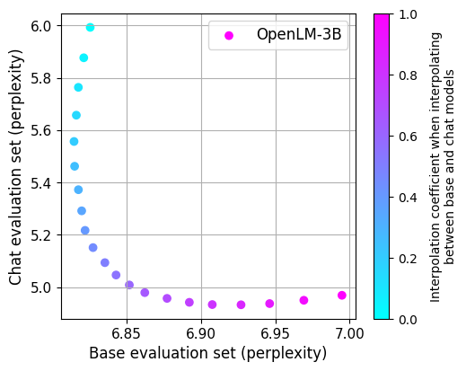

# Instruction tuning and weight averaging

Note that some of these stpes may be out of date, but the general flow should remain.

We downloaded the data from https://huggingface.co/datasets/timdettmers/openassistant-guanaco then ran `python datapreprocess/make_assistant_data.py --input-files /fsx/home-mitchellw/openassistant_best_replies_train.jsonl --output-dir /fsx/home-mitchellw/tmp --num-workers 1 --num-consumers 1`. Note that we changed shard size so there would be at least 8 shards.

```
torchrun --nproc-per-node 8 -m open_lm.main \
    --train-data "pipe:aws s3 cp s3://<bucket>/lmdata/assistant_data/train/shard-{0000000..0000008}.tar -" \
    --train-num-samples 4382720 \
    --workers 1 \
    --precision amp_bfloat16 \
    --batch-size 8 \
    --grad-checkpointing \
    --log-every-n-steps 1 \
    --grad-clip-norm 1 \
    --lr 2e-5 \
    --model g3b_neox \
    --fsdp --fsdp-amp \
    --warmup 100 \
    --wd 0.1 \
    --beta2 0.95 \
    --epochs 6 \
    --disable-buffer \
    --lr-cooldown-end 5e-6 \
    --report-to wandb \
    --wandb-project-name lmtune \
    --pretrained /fsx/home-mitchellw/experimetns/lm/1p5T-bigdata-neox-g3b_neox-10-1e-3-0.1-nodes48-bs10-v0/checkpoints/epoch_24.pt \
    --name instruction-tune-3b-2e-5-6 \
    --logs /fsx/home-mitchellw/experimetns/lmtune
```

Now we want to interpolate between the base and fine-tuned model with different coefficients alpha. We can do so with this bash script.

```
BASEMODEL=/fsx/home-mitchellw/experimetns/lm/1p5T-bigdata-neox-g3b_neox-10-1e-3-0.1-nodes48-bs10-v0/checkpoints/epoch_24.pt
FINALMODEL=/fsx/home-mitchellw/experimetns/lmtune/instruction-tune-3b-2e-5-6/checkpoints/epoch_6.pt
MODEL=g3b_neox

for alpha in $(seq 0 0.05 1)
do

    #echo $model
    save_path_1="$(dirname $FINALMODEL)/chat-eval-interpolate-$alpha-$(basename $FINALMODEL)"
    save_path_2="$(dirname $FINALMODEL)/base-eval-interpolate-$alpha-$(basename $FINALMODEL)"

    echo $save_path_1
    echo $save_path_2


    if [ -f "$save_path_1" ]; then
        echo "$save_path_1 exists."
    else
        # first do the chat eval.
        torchrun --nproc-per-node 4 -m open_lm.main \
            --val-data "pipe:aws s3 cp s3://<bucket>/lmdata/assistant_data/val.tar -" \
            --workers 6 \
            --precision amp_bfloat16 \
            --batch-size 8 \
            --grad-checkpointing \
            --log-every-n-steps 1 \
            --model $MODEL \
            --fsdp --fsdp-amp \
            --train-num-samples 1000000000 \
            --name $RANDOM \
            --average $BASEMODEL $FINALMODEL \
            --average-coefficients $alpha $(echo "1-$alpha" | bc -l) \
            --logs /fsx/home-mitchellw/experimetns/lmdebug  > $save_path_1

        # now do the base eval
        torchrun --nproc-per-node 4 -m open_lm.main \
            --val-data "pipe:aws s3 cp s3://<bucket>/lmdata/validation_data_tokenized/open_lm//shard_00000000.tar -" \
            --workers 6 \
            --precision amp_bfloat16 \
            --batch-size 8 \
            --grad-checkpointing \
            --log-every-n-steps 1 \
            --model $MODEL \
            --data-key json \
            --fsdp --fsdp-amp \
            --train-num-samples 1000000000 \
            --name $RANDOM \
            --average $BASEMODEL $FINALMODEL \
            --average-coefficients $alpha $(echo "1-$alpha" | bc -l) \
            --logs /fsx/home-mitchellw/experimetns/lmdebug  > $save_path_2
    fi
done
```

Then you can make a plot with `python plots/interpolation.py` which results in the following plot.

